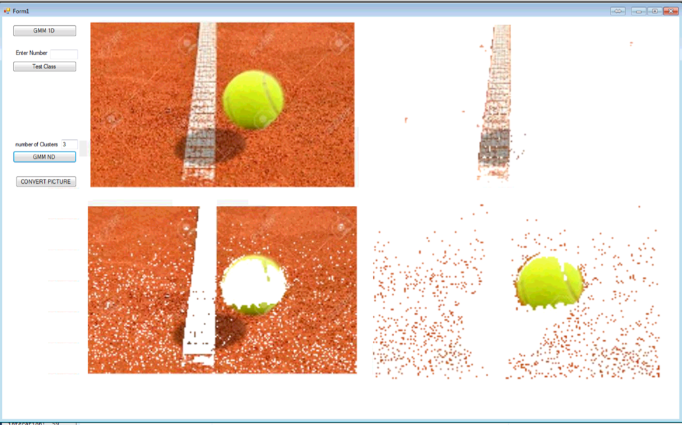

# Solving-Gaussian-Mixture-Model-Using-Swarm-Intelligence
Using optimization algorithm Swarm Intellegence to solve Gaussian Mixture Model
The algorithm is implemeted in a picture. The algorithm extract the tennis ball from the picture.
This result is obtained after 20 interations. The result should be much improved with more itereation.

